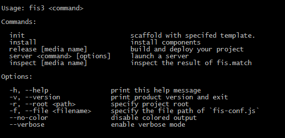
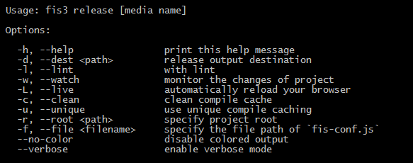
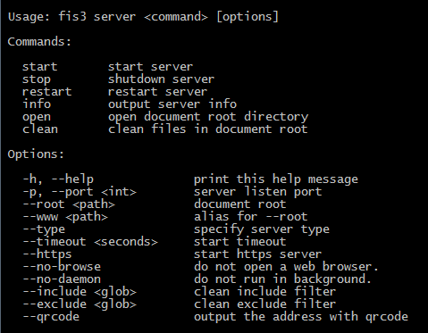
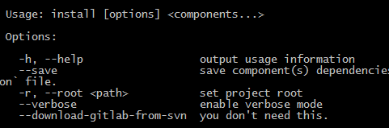

# 04 体验fis3 demo 发布一个项目
```
fis3 release -d ../dest
```
>### 发布项目到指定的dest文件夹下面


>### 可以通过fis3 -h查看所有指令


>### 可以通过fis3 release -h查看参数

>>```
>>没有参数，默认向内置的服务器发布
>>-d 向某一个目录发布（注意：绝对不能在当前>>目录下发布，否则会嵌套发布）
>>-w 监听发布 （当文件改变的时候，会自动发>>布）
>>-c 清除缓存
>>	-L 浏览器自动更新
>>参数可以组合使用的-wd
>>
>>```

>### fis3 server -h查看参数
>> 
>> ```
>> Start 启动服务器
>> Stop 关闭服务器
>> Restart 重新服务器
>> Info 查看服务器信息
>> open 打开服务器根目录
>> clean 清除服务器根目录内的文件
>> -p 设置端口号
>> 
>> ```

>### fis3 install -h查看参数
>>
>> ```
>> fis3 install 组件名称
>> ```

[所有插件地址：https://github.com/fis-components/components/tree/master/modules](https://github.com/fis-components/components/tree/master/modules)